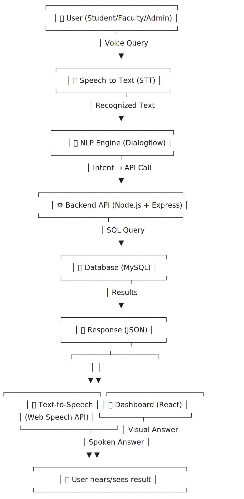

# CAMPUSTALK: Smart Voice Assistant for Academic Management

## 📌 Project Overview
CAMPUSTALK is an AI-powered smart voice assistant built to simplify campus academic management. 
It allows students, faculty, and administrators to access **timetables, attendance, and notices** instantly through voice or text. 
By unifying academic information into a single, accessible platform, it reduces confusion, saves time, and makes campus life more efficient.

## 🚀 Key Features
- **Voice-first interaction**: Ask "When is my next class?" or "Show today’s attendance" and get instant answers.
- **Role-aware system**: Different responses for students, faculty, and admins.
- **Unified dashboard**: Combines timetable, attendance, and notices in one place.
- **Expandable design**: Future scope includes library access, fee updates, and more.

## 🛠️ Tech Stack
### Frontend
- React.js, React Router
- TailwindCSS / Bootstrap (UI styling)
- Web Speech API (STT/TTS)

### Backend
- Node.js + Express.js (REST API)
- JWT for authentication & role-based access

### Database
- MySQL (student, faculty, timetable, attendance, notices)

### AI / NLP
- Dialogflow (Intent recognition)
- Google Speech-to-Text API
- Google Text-to-Speech / Web Speech API

### Deployment & Tools
- GitHub/GitLab for version control
- Vercel/Netlify (Frontend hosting)
- Render/Heroku/AWS (Backend hosting)
- Cloud SQL / MySQL server (Database)
- Postman (API testing)

## 🔄 Working Flow
Below is the system workflow:

1. **User speaks query** (e.g., "What is my timetable today?").  
2. **Speech-to-Text** converts voice into text.  
3. **NLP Engine (Dialogflow)** identifies intent.  
4. **Backend API (Node.js)** queries the **MySQL database**.  
5. The backend returns results in **JSON format**.  
6. **Text-to-Speech (TTS)** speaks the answer back.  
7. The **React Dashboard** displays the response visually.  

## 👥 Team Members
- Adarsh Shukla  
- Akshansh Srivastava  
- Anamika Singh
- Ankush Singh Bhadauriya  
- Anshika Jain  

## ✅ Why CAMPUSTALK?
- Makes academic management **fast, simple, and accessible**.  
- Reduces workload for faculty and administrators.  
- Helps students stay informed in real-time.  
- Designed for tomorrow’s **digital and connected campus**.

---
